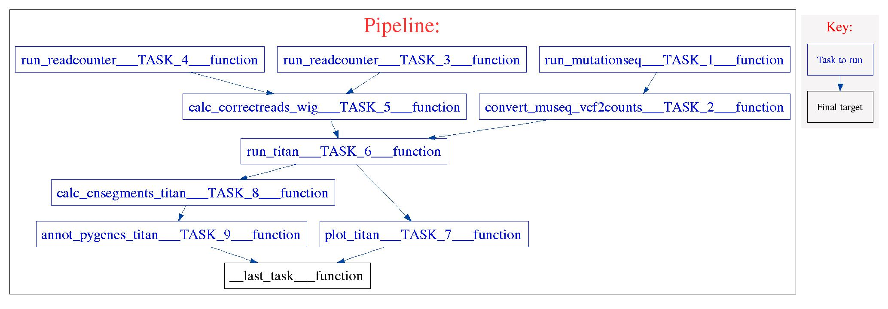

### Titan Pipeline:


```
Development information

Date Created: October 30 2014
Last Update: Mar 4, 2016 by dgrewal
Date Created: October 30 2014
Developer: Diljot Grewal <dgrewal@bccrc.ca>
Input: bam
Output: params.txt, .RData, seg, segs.txt, segs.txt.pygenes, titan.txt
Version: 5.3
```

TITAN pipeline accepts a list of tumour-normal pair of BAM files as input and infers the clonal cluster of events along with their estimates of cellular prevalence, normal contamination and tumour ploidy. The pipeline follows these steps:

* Identify germline heterozygous SNP positions in the matched normal BAM file. This step is represented by run\_mutationseq\_TASK\_1 in the workflow

* Extract the tumour allele read counts from the tumour BAM file at each of the germline heterozygous SNPs from Step 1. (Generates input file #1). This step is represented by run\_mutationseq\_TASK\_1 and convert\_museq\_vcf2counts\_TASK\_2 in the workflow

* Extract the tumour read depth from the tumour BAM file using HMMcopy suite. Correct GC content and mappability biases using HMMcopy R package. (Generates input file #2).  This step is represented by the following tasks in the workflow:

    * run\_readcounter\_TASK\_3,

    * run\_readcounter\_TASK\_4,

    * calc\_correctreads\_wig\_TASK\_5

* Run TitanCNA, including generating figures for chromosome plots. This step is represented by the following tasks in the workflow:

    * run\_titan\_TASK\_6,

    * plot\_titan\_TASK\_7,

    * calc\_cnsegments\_titan\_TASK\_8,

    * annot\_pygenes\_titan\_TASK\_9




### 1. Getting Started ###

The documentation for Kronos can be found [here](http://kronos.readthedocs.org/en/latest/).

Please install kronos or run the following command if you are running the pipeline on genesis head node to set the necessary environment paths

```
source /shahlab/pipelines/kronos/setenv.sh
```

### 2. The Inputs ###

The pipeline takes a tab delimited file as input. The header of the file defines the keys and the each of the rows represents a value for these keys.

An input file for pipeline should resemble the following:

```
#sample_id    tumour_id    tumour_library_id    tumour    normal_id    normal_library_id    normal
SA123_A01234_SA123N_A01235    SA123    A01234    /path/to/SA123.bam    SA123N    A01235    /path/to/SA123N.bam
```


### 3. Setup ###

#### 3.1 Running the pipeline on a shahlab or genesis clusters ####

The pipeline includes 2 setup files, one for each input type. The files are:

* __titan_setup_genesis.txt__: setup file for running the pipeline on the genesis cluster
* __titan_setup_shahlab.txt__: setup file for running the pipeline on the shahlab cluster

The setup files contain the path to the required softwares and reference files.


#### 3.2 Running the pipeline on a different cluster ####

The genesis and shahlab clusters are for shahlab's internal use only. If you don't have an account on these clusters or wish to setup the pipeline yourself, please refer to the following instructions.

The pipeline requires the following:

__Softwares__

<table border="1">
<tr><th>Package/Program</th><th>Version *</th></tr>
<tr><td><a href="https://www.python.org/ftp/python/2.7.9/Python-2.7.9.tgz">python</a></td><td>2.7.x</td></tr>
<tr><td><a href="http://compbio.bccrc.ca/software/mutationseq/">mutationseq</a></td><td>4.3.7</td></tr>
<tr><td><a href="https://www.r-project.org/">R</a></td><td>3.1.x or higher</td></tr>
</table>


* python should have the following packages installed:
        * [sklearn 0.14.1](http://scikit-learn.org/stable/) (Other versions are not supported)
    * [IntervalTree](https://pypi.python.org/pypi/intervaltree)
    * [numpy](http://www.numpy.org/) (tested for version 1.7.1 and highly recommended to link against BLAS)
    * [scipy](http://www.scipy.org/) (tested for version 0.12.0)
    * [scikits-learn](http://scikit-learn.org/) (tested for version 0.14.1)
    * [matplotlib](http://matplotlib.org/) (tested for version 1.2.1)
    * bamtools (tested for version 2.3.0 but modified slightly to meet our needs. It is provided in the package.)
    * [boost](http://www.boost.org) (version 1.51.0 or higher)

* R should have the following packages installed:
    * [TITANCNA and dependencies](https://www.bioconductor.org/packages/release/bioc/html/TitanCNA.html) 
    * [doMC](https://cran.r-project.org/web/packages/doMC/index.html)
    * [SNPChip](http://www.numpy.org/) (https://www.bioconductor.org/packages/release/bioc/html/SNPchip.html)


__Installing mutationSeq:__

_Mutationseq_ relies on the pybam library which must be compiled before you can start running the pipeline. To check if the library is compatible with your python please follow the following steps:

        cd /path/to/pipeline/components/run_mutationseq/component_seed/
        python
        >>> import pybam
  An incompatible pybam library should generate an exception similar to the following:

        ImportError: ./pybam.so: undefined symbol: PyUnicodeUCS4_FromEncodedObject

To recompile the pybam library follow the following steps:

        cd /path/to/pipeline/components/run_mutationseq/component_seed/
        rm -rf pybam.so
        rm -rf build/
        make BOOSTPATH=/path/to/boost

The make command requires python to compile the library. It will use the default python for the system. Please ensure that the path to your python installation is added in the PATH variable. You can check if your python install is set propearly by running:

        which python

The command should point to the python installation that will be used to run the pipeline. Mutationseq documentation can be found [here](http://compbio.bccrc.ca/software/mutationseq/)


__Mutationseq Models:__

mutationseq uses different models for the paired and the single mode. The models are pickled with python 2.7.\* and sklearn 0.14.1 and should be loaded on a similar setup. The model compatibility can be checked in the python interpreter by running

        python
        >>>from sklearn.externals import joblib
        >>>_ = joblib.load('/path/to/model.npz')

An incompatible model file will generate an exception similar to the following:

        TypeError: __cinit__() takes exactly 3 positional arguments (8 given)

        AttributeError: 'module' object has no attribute 'BestSplitter'

        ValueError: Buffer dtype mismatch, expected 'SIZE_t' but got 'int'
while an IOError exception would indicate an incorrect path.


__Reference files and flags__

In order to run the museq pipeline you will need to add the paths to the following data in the setup file:
* __python__: path to the python executable
* __mutationseq__: path to the mutationseq executable
* __R__: path to the R executable
* __reference__: path to the reference genome fasta file
* __ld_library_path__: specify ld_library_path for the python (set to None if the path is set properly)
* __pythonpath__: specify path to python's site-packages (set to None if the path is set properly)
* __positions_file__: path to the positions_file file
* __map__: path to the map file
* __gc__: path to the gc file
* __gene_sets_gtf__: path to the gene_sets_gtf file
* __interval_file__: path to the interval file (included with the pipeline)
* __r_libs__: specify R_LIBS for loading the R packages (set to None if set properly or if packages are installed globally)
* __genome_type__: specify the reference genome type (NCBI or UCSC)
* __model__: path to the mutationseq model file (model_single_v4.0.2.npz file, included with mutationseq)
* __museq_interval_file__: set to None if using the NCBI genome, specify path to the interval file included with the pipeline if running on UCSC aligned bam files
* __y_threshold__: threshold on the required number of calls in y-chromosome to consider it when running TITAN
* __target_list__: path to the target_list file (required if running on exomes)
* __chromosomes__: specify the target chromosomes for TITAN.


### 4. The output ###
The output files will be saved in:

        /path/to/output/directory/{run_id}/{sample_id}/outputs/

The Titan Pipeline generates the following output files:

* {sample\_id}\_outigv\_[0-n].seg.pygenes \* : Pygenes annotated IGV compatible segments
* titan\_plots/ : Each data point for each of the tracks represent a germline heterzygous SNP loci in the TITAN analysis. There are 3 tracks generated  for each plot
   * Copy number alterations (log ratio)
   * Loss of heterozygosity (allelic ratio)
   * Cellular prevalence and clonal clusters)

 \* n depends on interval file

All final results are stored in the outputs/results/ directory.


### 5. Changelog ###
* v5.3 fixed a bug in calc_optimal_clusters, updated titan parameter names
* v5.2 switched from pipeline factory to kronos
* v4.6 pipeline suggests an optimal cluster.
* v4.8 added support for new shahlab cluster
* v5.0 performance improvements

### For more information ###
http://kronos.readthedocs.org/en/latest/
or contact dgrewal@bccrc.ca
